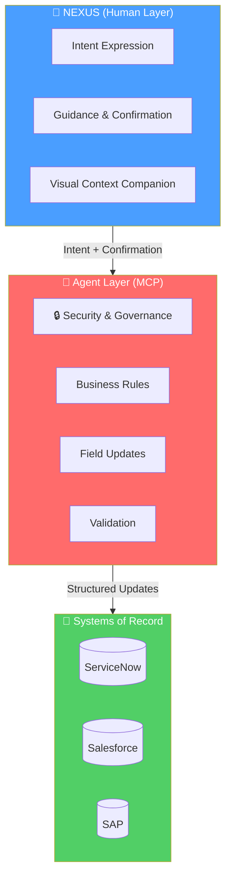
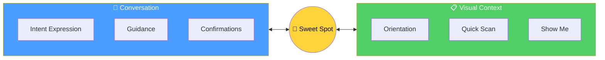
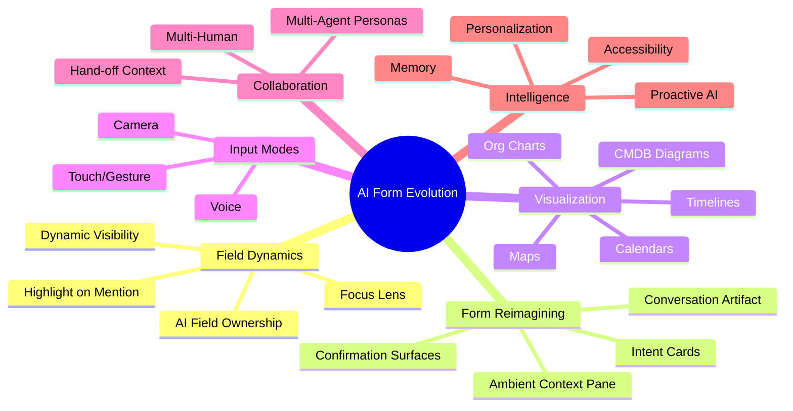
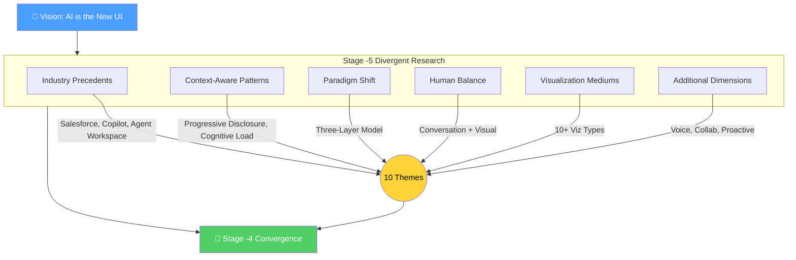

# Stage -5 Research Visualization

## The Three-Layer Architecture

```mermaid
flowchart TB
    subgraph NEXUS["👤 NEXUS (Human Layer)"]
        direction LR
        H1[Intent Expression]
        H2[Guidance & Confirmation]
        H3[Visual Context Companion]
    end
    
    subgraph AGENT["🤖 Agent Layer (MCP)"]
        direction LR
        A1[🔒 Security & Governance]
        A2[Business Rules]
        A3[Field Updates]
        A4[Validation]
    end
    
    subgraph SOR["💾 Systems of Record"]
        direction LR
        S1[(ServiceNow)]
        S2[(Salesforce)]
        S3[(SAP)]
    end
    
    NEXUS -->|"Intent + Confirmation"| AGENT
    AGENT -->|"Structured Updates"| SOR
    
    style NEXUS fill:#4a9eff,color:#fff
    style AGENT fill:#ff6b6b,color:#fff
    style SOR fill:#51cf66,color:#fff
```

## The Human Balance

```mermaid
flowchart LR
    subgraph CONV["💬 Conversation"]
        C1[Intent Expression]
        C2[Guidance]
        C3[Confirmations]
    end
    
    subgraph VISUAL["📋 Visual Context"]
        V1[Orientation]
        V2[Quick Scan]
        V3[Show Me]
    end
    
    CENTER((🎯 Sweet Spot))
    
    CONV <--> CENTER
    CENTER <--> VISUAL
    
    style CENTER fill:#ffd43b,color:#000
    style CONV fill:#4a9eff,color:#fff
    style VISUAL fill:#51cf66,color:#fff
```

## Bold Ideas Map

```mermaid
mindmap
  root((AI Form Evolution))
    Field Dynamics
      Focus Lens
      Dynamic Visibility
      AI Field Ownership
      Highlight on Mention
    Form Reimagining
      Conversation Artifact
      Intent Cards
      Confirmation Surfaces
      Ambient Context Pane
    Visualization
      Maps
      Timelines
      Org Charts
      Calendars
      CMDB Diagrams
    Input Modes
      Voice
      Camera
      Touch/Gesture
    Collaboration
      Multi-Human
      Multi-Agent Personas
      Hand-off Context
    Intelligence
      Proactive AI
      Memory
      Personalization
      Accessibility
```

## Research Theme Flow

```mermaid
flowchart TD
    VISION[🚀 Vision: AI is the New UI] --> RESEARCH
    
    subgraph RESEARCH[Stage -5 Divergent Research]
        R1[Industry Precedents]
        R2[Context-Aware Patterns]
        R3[Paradigm Shift]
        R4[Human Balance]
        R5[Visualization Mediums]
        R6[Additional Dimensions]
    end
    
    RESEARCH --> CONVERGENCE[🎯 Stage -4 Convergence]
    
    R1 --> |Salesforce, Copilot, Agent Workspace| INSIGHTS
    R2 --> |Progressive Disclosure, Cognitive Load| INSIGHTS
    R3 --> |Three-Layer Model| INSIGHTS
    R4 --> |Conversation + Visual| INSIGHTS
    R5 --> |10+ Viz Types| INSIGHTS
    R6 --> |Voice, Collab, Proactive| INSIGHTS
    
    INSIGHTS((10 Themes)) --> CONVERGENCE
    
    style VISION fill:#4a9eff,color:#fff
    style CONVERGENCE fill:#51cf66,color:#fff
    style INSIGHTS fill:#ffd43b,color:#000
```
