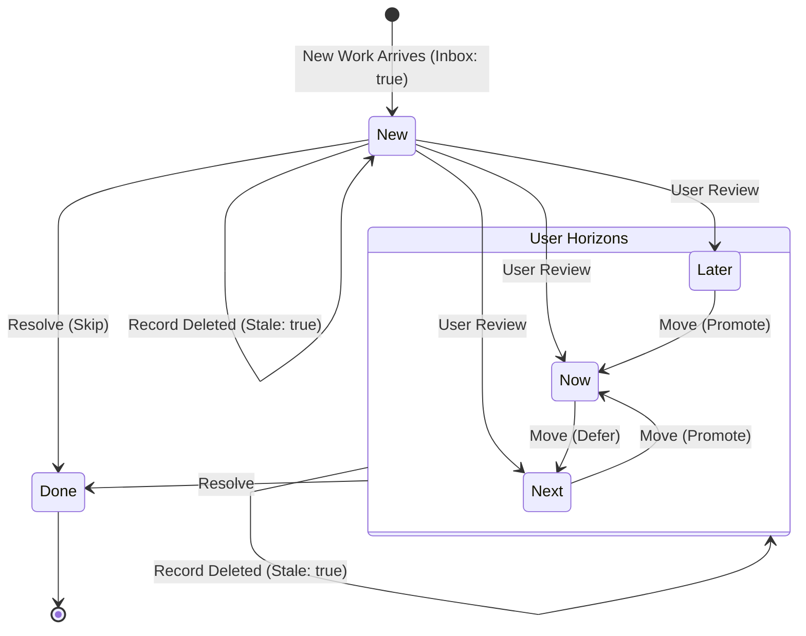

# DISCO-004: Card & Canvas UI
## Discovery Log

**Created**: 2026-01-23
**Status**: In Progress (T-6 Vision)
**Objective**: Define the Card & Canvas UI components for NEXUS.

---

## Context

Cards are persistent activity representations (incidents, tasks, etc.) that live on the NEXUS Canvas. Users click cards to open the Workbench (DISCO-001).

### Related Discoveries
- **DISCO-001**: NEXUS Workbench (UI opened FROM cards)
- **DISCO-002**: Integration Layer (card data model defined)

### Data Model (from DISCO-002)
```yaml
Card:
  collection: "users/{userId}/cards/{cardId}"
  properties:
    activityId: "string (SoR record ID)"
    activityType: "string (incident, change, etc.)"
    title: "string"
    summary: "string?"
    priority: "string? (for sorting/coloring)"
    lastUpdated: "timestamp"
    archived: "boolean (default: false)"
    fields: "ActivityField[]"
```

---

## Stage T-6: Vision 🔄

**In Progress**: 2026-01-23

---

### Workbench Integration Decisions

| Decision | Options Discussed | Choice | Rationale |
|----------|------------------|--------|-----------|
| **Multiple workbenches?** | A) Single modal, B) Tabs, C) Tiled, D) PiP | **A) Single only** | Simplest, no tabs |
| **Resting state** | Workbench visible vs Canvas | **Canvas** | Cards visible when no workbench |
| **Trigger sources** | Card, search, list, keyboard, notification | **Card click only** | For demo, add others later |

---

### Canvas Type Decisions

| Decision | Options Discussed | Choice | Rationale |
|----------|------------------|--------|-----------|
| **Other canvas types** | Map, CMDB, Gantt, Calendar, Catalog | **Out of scope** | Future phases |
| **Build strategy** | A) Single, B) Tabs, C) Pluggable | **Design for C, Build for A** | Future-proof architecture |

**What this means:**
- **Design for C (Pluggable):** The architecture will support multiple canvas "renderers" (card grid, CMDB diagram, Gantt chart, etc.) where the same data can be visualized differently.
- **Build for A (Single):** For this phase, we only build the card grid view. But the code structure allows adding other views later without rewriting core logic.

**Pluggable Canvas Architecture:**
```
Canvas = Container + Renderer

"My Work"   → CardCanvas renderer (cards in grid)
"CI Map"    → CMDBCanvas renderer (future)
"Sprint"    → GanttCanvas renderer (future)
```

---

### Canvas Ownership Decisions

| Decision | Options Discussed | Choice | Rationale |
|----------|------------------|--------|-----------|
| **Ownership model** | System (Gmail), User (Notion), Hybrid (Slack) | **Hybrid** | "My Work" default, user-created later |

**What this means:**
- **System-provided canvases:** Every user automatically gets a "My Work" canvas. They can't delete it. This ensures a consistent starting point.
- **User-created canvases (future):** Power users could create additional canvases like "P1 War Room" or "Vendor Issues" with custom filters.

**Hybrid Model:**
- **System provides:** "My Work" canvas (always there)
- **User can create (later):** Named canvases for specific contexts

---

### Filter Design Decisions

| Decision | Options Discussed | Choice | Rationale |
|----------|------------------|--------|-----------|
| **Filter ownership** | Canvas-specific, Global, Hybrid | **Hybrid (Option 3)** | System filters + custom later |

**What this means:**
- **System Filters:** Standard filters (Type, Priority, State) are always available on every canvas. The user doesn't have to configure these.
- **Canvas Preset (future):** A saved canvas could have a default filter like "Priority=1" that applies when you open it.
- **Custom Filters (future):** Power users could add their own filters like "SLA Breach" or "My Team Only".

**Key Principle:** Filters are data, not code.

This means filters are stored as configuration (JSON/YAML), not hardcoded as React components. This makes it easy to add new filter types without changing the UI code.

**Future-Proof Data Model:**
```yaml
Canvas:
  id: string
  name: string                    # "My Work" or user-defined
  type: "card" | "cmdb" | "gantt" # For future renderers
  owner: "system" | userId        # Who created it
  baseQuery:                      # Saved filter preset
    filters: FilterCriteria[]
    sort: SortCriteria
  customFilters:                  # User-defined extras (future)
    - { field: "sla_breach", label: "SLA Breach", type: "boolean" }

FilterCriteria:
  field: string          # "priority", "state", "activityType"
  operator: "eq" | "in" | "gt" | "lt" | "contains"
  value: any
```

---

### What We Build Now (DISCO-004 Scope)

| Component | Include? | Notes |
|-----------|----------|-------|
| "My Work" canvas | ✅ Yes | Default, system-provided |
| Card component | ✅ Yes | Visual + click interaction |
| System filters | ✅ Yes | Type, Priority, State |
| User-created canvases | ❌ No | Architecture supports, not built |
| Custom filters | ❌ No | Architecture supports, not built |
| Other renderers | ❌ No | Future phases |

---

### Vision Statement ✅

> **The canvas is the human-centric view of work.**

This means the canvas isn't just a list of records - it's an intelligent surface that understands what matters to YOU and helps you focus on the right things.

---

### Canvas Requirements (Detailed)

#### R1: Show **why** something matters
**Not just raw data, but context.**

Instead of: "INC0010001 - Priority 2"
Show: "VPN Outage - 47 users affected, SLA at risk"

The card should answer "Why should I care about this right now?"

---

#### R2: Surface **urgency/importance** intelligently
**AI-driven prioritization, not just database order.**

The canvas shouldn't just sort by creation date. It should understand:
- This is a P1 (very urgent)
- SLA is about to breach (time pressure)
- VIP customer is affected (business context)
- Multiple related tickets (pattern)

And present the most important items prominently.

---

#### R3: Reveal **patterns and relationships**
**"These 3 are related"**

When 5 incidents come in about the same CI or same issue, the canvas should:
- Group them visually
- Suggest "These might be the same problem"
- Help you see the forest, not just trees

---

#### R4: **Adapt dynamically**
**Living workspace, not static folders.**

Unlike a traditional folder structure where you file things once:
- Cards move/resize as their urgency changes
- New patterns emerge and get highlighted
- Old resolved items fade or archive automatically

---

#### R5: **Work finds the human**
**Proactive, not just reactive.**

Instead of you hunting for work:
- Important items surface to the top
- AI might say "You should look at this"
- Notifications bring attention to what changed

---

#### R6: **Simple to browse**, powerful to filter
**Finder-like ease.**

The basic experience should be as simple as macOS Finder:
- Sidebar with filters
- Click to filter
- Search to find
- Click to open

But with powerful advanced filtering when needed.

---

#### R7: Show **time/SLA context**
**Due dates, breach risk.**

Time is critical in work management:
- Show when things are due
- Highlight SLA at risk
- Maybe cards "grow" or change color as deadline approaches

---

#### R8: Distinguish **work flow directions**
**To me, from me, with me, about me.**

Not all cards are the same kind of "my work":

| Direction | Description | Canvas Behavior |
|-----------|-------------|-----------------|
| **To Me** | Work assigned/delegated to me | Prominent, actionable - "I need to do something" |
| **From Me** | Work I delegated to others | More subtle - "I'm waiting for someone else" |
| **With Me** | Collaborative work | Shared - "We're both working on this" |
| **About Me** | Updates I should know about | Informational - "FYI, this changed" |

---

#### R9: Card presentation is **dynamic** based on importance factors
**Cards that "know" their importance.**

This is a key innovation: cards aren't all the same size/style. Instead:

- **Urgent P1 incident:** Large card, prominent color, maybe animated border
- **Normal P3 task:** Medium card, subtle styling
- **Low priority FYI:** Compact card, minimal visual weight

The card's appearance adapts based on:
- Priority level
- SLA proximity
- Your role (assigned to you vs. FYI)
- Recency (just updated = highlighted)
- AI assessment ("This looks important")

**Guardrails:** To prevent visual chaos:
- Max card size: 400px wide
- Min card size: 100px wide
- Color intensity: Accent colors, not solid loud colors

---

#### R10: Importance factors are **source-agnostic**
**Works with any data source, not just ServiceNow.**

Since cards could come from ServiceNow, Salesforce, Jira, or anything else:

| Approach | How It Works |
|----------|--------------|
| **Field mapping** | The adapter declares "this field = priority" |
| **AI inference** | If no field mapped, AI reads the content and guesses urgency |
| **Hybrid** | Use explicit field if available, fall back to AI inference |

This means R9 (dynamic cards) works even if the source system doesn't have a "priority" field.

---

### Card Content Decision

Based on our discussion about dynamic cards:

| State | What's Visible |
|-------|----------------|
| **Compact (low priority)** | Title only, priority badge |
| **Normal** | Title, type, priority, time indicator |
| **Expanded (high priority)** | Title, summary, priority, SLA, assignee |
| **Hover/Focus** | Any card expands to show full details |

---

#### R11: Card prominence is **relative** to other cards on canvas
**They can't all be large and flashing red.**

Priority is contextual:
- If you have 10 P1s, they can't ALL be huge and flashing
- The system must **allocate visual weight** across the canvas
- One "most urgent" stands out, others scale down
- Like a newspaper: one headline, several sub-headlines, many articles

| Scenario | Visual Allocation |
|----------|------------------|
| 1 P1, 9 P3s | P1 is HUGE, P3s are compact |
| 10 P1s | Top 1-2 are large, rest are medium |
| All same priority | Even sizing, recency breaks ties |

**Who decides allocation:** Hybrid (Rules as baseline, AI can override)

---

### Visual Questions (Completed)

| Question | Decision |
|----------|----------|
| **Layout** | Grid with dynamic sizing (deferred to T-2 Design) |
| **Priority Visual** | All methods available (size, color, position, animation) - AI/rules determine, relative to other cards |
| **Aesthetic** | Match workbench (DISCO-001), prototype in T-2 |
| **Inspiration** | Intelligent Finder + newspaper allocation |

---

## Stage T-6: Vision Summary

### Vision Statement
> **The canvas is the human-centric view of work.**

### 11 Requirements

| # | Requirement |
|---|-------------|
| R1 | Show **why** something matters |
| R2 | Surface **urgency/importance** intelligently |
| R3 | Reveal **patterns and relationships** |
| R4 | **Adapt dynamically** |
| R5 | **Work finds the human** |
| R6 | **Simple to browse**, powerful to filter |
| R7 | Show **time/SLA context** |
| R8 | Distinguish **work flow directions** |
| R9 | Card presentation is **dynamic** based on importance |
| R10 | Importance factors are **source-agnostic** |
| R11 | Card prominence is **relative** to other cards |

---

## Stage T-5: Research 🔄

**In Progress**: 2026-01-23

### Research Area 1: Card UI Patterns (2025)

#### Core Principles (Industry Standard)

| Principle | Description | Why It Matters |
|-----------|-------------|----------------|
| **One card = one concept** | Each card represents a single task/idea | Prevents cognitive overload |
| **Clear visual hierarchy** | Size, color, typography guide attention | Users scan efficiently |
| **Generous whitespace** | Spacing between/within cards | Cards stand out as units |
| **Scannable content** | Essential info upfront ("previews") | Quick comprehension |
| **Intuitive interactivity** | Entire card clickable, hover feedback | Touch-friendly |
| **Responsive** | Adapts to screen sizes | Consistent cross-device |
| **Accessible** | Color contrast, font sizes, keyboard nav | Inclusive design |

#### Emerging Trends (2025)

| Trend | Description | Relevance to NEXUS |
|-------|-------------|-------------------|
| **Neumorphism 2.0** | Soft shadows + flatter aesthetic | Modern, tactile feel |
| **Swipeable cards** | Quick actions via swipe gestures | Mobile-first, quick archive/action |
| **Glassmorphism** | Transparent, blurred elements | Matches workbench aesthetic |
| **Animated transitions** | Smooth expand/collapse, feedback | Workbench bloom already uses this |
| **Container transform** | Cards expand to reveal more content | Hover-to-expand pattern we discussed |

#### Application Examples

| App | Card Approach | Takeaway |
|-----|---------------|----------|
| **Notion** | Highly customizable, drag-and-drop, database entries as cards | Flexibility, user control |
| **Linear** | Kanban-style, minimal, task progression visible | Clean prioritization |
| **Todoist** | Adaptive Cards, essential details, quick actions | Action-oriented |

---

### Research Area 2: Priority Visualization

#### How Others Show Urgency

| Method | Examples | Pros | Cons |
|--------|----------|------|------|
| **Color coding** | Red/yellow/green badges | Universal understanding | Can be overwhelming |
| **Size variation** | Larger = more important | Visual weight is intuitive | Needs careful balance |
| **Position** | Top/first = priority | Natural reading order | Limits layout flexibility |
| **Animation** | Pulse, glow, shake | Grabs attention | Can be distracting |
| **Typography** | Bold, larger text | Subtle but effective | May not stand out enough |

#### Key Insight: Relative Weight Allocation

From our T-6 discussion (R11):
- Priority is **contextual**, not absolute
- System must **allocate visual weight** across canvas
- Like newspaper: one headline, several sub-headlines, many articles

No existing tools found that do this well - **this is a differentiator for NEXUS**.

---

### Research Area 3: Canvas Interactions

#### Grid vs Freeform

| Approach | Pros | Cons | Examples |
|----------|------|------|----------|
| **Grid** | Clean, predictable, auto-layout | Less personal, rigid | Notion gallery, iOS apps |
| **Freeform** | Spatial, creative, memorable | Can get messy | Miro, FigJam |
| **Kanban** | Shows workflow, progression | Forces state-based model | Trello, Jira |
| **Hybrid** | Flexible with guided constraints | More complex to implement | Notion boards |

**Recommendation for NEXUS:** Grid with dynamic sizing (cards resize, but snap to grid).

---

### Research Area 4: AI-Driven UI

No strong examples found of AI determining card layout/prominence. This is **innovative territory**.

Closest concepts:
- Gmail Priority Inbox (AI determines importance, but same card size)
- Spotify Discovery (AI curates, but playlist format)
- Apple Photos Memories (AI groups, but slideshow format)

**NEXUS R9-R11 are novel** - AI/rules allocate visual weight dynamically.

---

### Research Summary

| Finding | Implication for DISCO-004 |
|---------|---------------------------|
| One card = one concept | Keep cards focused on single activity |
| Hover to expand | Confirmed as good pattern |
| Glassmorphism trending | Match workbench aesthetic |
| Swipeable for quick actions | Consider for archive gesture |
| Relative priority is novel | Differentiate with R11 |
| Grid with dynamic sizing | Best of both worlds |
| AI-driven layout is innovative | No direct precedent - we're pioneering |

---

## Stage T-4: Scoping 🔄

**In Progress**: 2026-01-23

### Prototype Created
- [prototype_canvas_v1.html](file:///Users/matthew.phipps/Documents/LEAP/1_LEAP/3_R&D_GoldSource/Discovery_Lab/DISCO-004_Card_And_Canvas_UI/T-4_Scoping/prototype_canvas_v1.html)
- Demonstrates: dynamic sizing, priority colors, sidebar filters, glassmorphism

---

### Card Fundamentals (Critical Discussion)

Before finalizing card visuals, we need to define card fundamentals.

#### What IS a Card?

**Proposed Model:** A card is a **user's personal bookmark** to a piece of work, enriched with context.

| Concept | Description |
|---------|-------------|
| **Not a copy** | Card doesn't duplicate SoR data |
| **Not just a pointer** | Card has its own state (read/unread, notes, importance override) |
| **Personal** | It's on YOUR canvas, even if others have the same work |
| **Contextualized** | Enriched with AI insights, history, and local state |

**Analogy:** Email is to Gmail what a Card is to NEXUS
- The email lives on a server (SoR)
- Your inbox shows your view of it (card)
- You can star it, snooze it, archive it (local state)
- If the email is deleted, your reference goes stale

---

#### Card Lifecycle

```
┌──────────────────────────────────────────────────────────┐
│                        CARD STATES                        │
├──────────────────────────────────────────────────────────┤
│                                                          │
│   [CREATED] ──► [ACTIVE] ──► [RESOLVED] ──► [ARCHIVED]  │
│        │            │              │                     │
│        │            ▼              ▼                     │
│        │      [WAITING]      [STALE/GONE]               │
│        │            │                                    │
│        └────────────┘                                    │
│                                                          │
└──────────────────────────────────────────────────────────┘
```

| State | Meaning | Who Controls |
|-------|---------|--------------|
| **Created** | Card just appeared on your canvas | System (from SoR or AI) |
| **Active** | You're working on this | You (implicit) |
| **Waiting** | Blocked, waiting on someone | You or AI infers |
| **Resolved** | Work is done in SoR | SoR sync |
| **Archived** | You dismissed it | You |
| **Stale** | SoR record deleted/inaccessible | Tombstone State (AI Explains) |

---

#### Card Creation Triggers (Notification-First)

| Trigger | Example | Resulting Behavior |
|---------|---------|-------------------|
| **Assigned to you** | INC0010001 assigned | Notification (Bell/Badge) ↠ User re-sorts ↠ Card appears |
| **You search/fetch** | "Show me P1 incidents" | Immediate appear (User initiated FETCH) |
| **AI suggests** | "This looks important" | Notification (Suggestion) ↠ User accepts ↠ Card appears |
| **You pin it** | Manually add a record | Immediate appear (User initiated PIN) |

**Key Principle:** The canvas is a "Stable Surface." New items never pop up automatically and re-flow existing layout. They wait in a notification/suggestion queue until the human invites them onto the canvas via a re-sort or explicit action.

---

#### Card Importance: Who Decides?

**Proposed Model:** Importance is **calculated by the Canvas**, not stored on the card.

```
Importance = f(
  SoR priority,
  SLA proximity,
  Your role (assigned? watching? FYI?),
  Recency,
  AI assessment,
  Other cards on canvas (relative - R11)
)
```

The **card** provides data, the **canvas** allocates visual weight.

---

#### Decisions Made (T-4 Session)

**Card Definition:** ✅ Confirmed
> A card is a **user's personal bookmark** to a piece of work, enriched with context.

---

### Integrated Navigation & Inbox Model ✅

This model integrates productivity horizons with the holding area and list-management capabilities.

#### Navigation & Filters
The Left Nav Bar serves as both **Filtering Surface** and **Drop Target** for organization:

| Filter | Purpose | Interaction |
|--------|---------|-------------|
| **Inbox** | New items + Cards with unread updates | Default landing for new awareness |
| **Now** | Active focus items | Immediate work |
| **Next** | Staged for after current work | High readiness |
| **Later** | Long-term backlog | Out-of-sight focus |
| **All** | Holistic list management | **List View** (not grid) |
| **Done** | Archived/Resolved items | Completion record |

#### The "No-Bounce" Persistence Rule
To maintain spatial memory (Review #1), items must not "drift" unexpectedly:
- **Rule**: If a card in `Now` receives an update, it **remains in its spatial location on the Now canvas** but *also* appears in the `Inbox`.
- **Reason**: This ensures the user sees the update in their "awareness stream" (Inbox) without the cognitive cost of their focus-surface (Now) being disrupted.

#### The "All" View (Holistic Management)
When the "All" filter is selected, the UI shifts from **Card Grid** to **List Mode**:
- **Display**: Horizontal rows (card-styling but compact).
- **Grouping**: Grouped by current state (Inbox > Now > Next > Later).
- **Control**: Users can drag and drop within the list to manually re-sort items and move them between groups.
- **Persistence**: Re-selecting a specific horizon (e.g., Now) returns the UI to the **Card Grid** view for that specific context.

#### Tombstone Logic (Stale Cards) ✅
When a source record becomes inaccessible (deleted, archived, or permission revoked):
- **Transition**: The card enters a **Tombstone State** (visual grayscale/semi-transparent).
- **Interaction**: Clicking the card triggers an **AI Explanation** in the workbench/canvas ("This work is no longer in your view. The source record was [reason]").
- **Resolution**: The user manually clears the card by marking it as **Done**. 
- **Benefit**: Ensures the user is never surprised by "vanishing work" and understands why a bookmark died.

#### Awareness vs. Focus (The "Black Hole" Solution) ✅
To prevent the "LATER" horizon from becoming a forgotten backlog without cluttering the current focus:
- **Focus Purity**: Horizon views (Now/Next/Later) remain strictly filtered. This reduces cognitive load and "backlog anxiety."
- **Ambient Awareness**: The **Nav Bar Badges** provide the awareness. If an urgent item enters a hidden horizon, the badge count increments and the color changes (e.g., Later badge turns Red).
- **Big Picture**: The **"All" View** (List mode) is the dedicated surface for holistic review and management.
- **AI-Driven Prominence (R9/R11)**: Within any view, the AI naturally scales cards based on their time horizon. A "Later" card will naturally have less visual weight (smaller, subtle accent) than a "Now" card, even in the "All" view.

#### AI-Human Control Model (Refined) ✅

**The Model (Focus-First):**
```
AI re-sorts (on demand) ↠ Human manages (horizons) ↠ AI re-sorts (fresh slate)
```

| Principle | Decision |
|-----------|----------|
| **Anchoring** | AI re-sorts **only** when requested by the human. The canvas is a "Stable Surface." |
| **No Pinning** | **DEFERRED.** After evaluation (v3 Prototype), manual pinning was deemed too complex for initial build. The system trusts the AI re-sort to correctly size and position cards based on current relative importance. |
| **Clean Slate** | Every ritual AI re-sort starts with a "clean slate" based on current SoR data and user-set horizons. |
| **Drop Targets** | The Left Nav Bar acts as the primary manual organization tool (Inbox/Now/Next/Later). |

---

### AI Notification & Awareness ✅

| Framework | Application |
|-----------|-------------|
| **Eisenhower Matrix** | Urgent vs Important drives AI sorting |
| **System 1/2 (Kahneman)** | Canvas = System 1 (glance), Workbench = System 2 (focus) |
| **Time Horizons** | NOW / TODAY / SOON / LATER |
| **Limited Attention** | Don't show too many prominent cards |

---

### AI Sorting Approach ✅

**Decision:** Option C - Teach AI principles, not formulas.

> Give AI the **principles** (Eisenhower thinking, user context), not a formula. Let AI apply judgment.

**Why not formulas?**
- Old school `a*b-c` rules are brittle
- AI can consider context we haven't thought of
- Still explainable via principles

**Example prompt framework:**
```
You are helping a user triage their work.
They can only focus on one thing at a time.
Sort by:
- What's most time-sensitive?
- What has biggest impact if delayed?
- What are they directly responsible for?
```

**Output:** AI returns presentation data for each card:

```json
{
  "cardId": "INC0010001",
  "position": 1,
  "size": "large",
  "accent": "red",
  "animate": true,
  "reason": "P1, SLA breach imminent"
}
```

---

### AI-First Presentation Model ✅

**Key Decision:** AI handles ALL presentation in one call.

| Dimension | Old Thinking | New Thinking |
|-----------|--------------|--------------|
| Position | AI | AI |
| Size | Rules | **AI** |
| Color/accent | Rules | **AI** |
| Animation | Rules | **AI** |

**Prompt Guidelines (Constraints):**
```
Present these cards for the user.
For each card, assign:
- position (1 = highest priority)
- size: compact | medium | large (max 2 large per view)
- accent: none | amber | red (red = urgent)
- animate: true/false (only for SLA breach or escalation)

Consider: time-sensitivity, impact, user's role, SLA status.
```

**Why This Works:**
- One AI call, not multiple calculations
- Easy to tune via prompt
- AI considers context we haven't thought of

---

### Human-Centric Card State

Instead of technical states, cards reflect **human relationship to work**:

| Human Feeling | Card Treatment |
|---------------|----------------|
| "I must focus on this" | Large, prominent |
| "That can wait" | Smaller, less prominent |
| "Tomorrow's problem" | Hidden in filter, badge shows status |
| "Ball in their court" | Dimmed, waiting indicator |
| "Done!" | Resolved, ready to archive |

---

### Design System Integration ✅

**Decision:** AI outputs semantic tokens, design system interprets.

| AI Outputs | Design System Maps To |
|------------|----------------------|
| `size: "large"` | CSS variables for card dimensions |
| `accent: "red"` | `--priority-p1` color token |
| `animate: true` | `@keyframes urgentPulse` |

**Why:** Ensures consistency across NEXUS, AI doesn't need to know CSS values.

---

### Time Horizons ✅

**Decision:** NOW / NEXT / LATER (productivity-focused, not calendar-based)

| Horizon | Meaning |
|---------|---------|
| **NOW** | Do this right now |
| **NEXT** | After current focus |
| **LATER** | Tomorrow or beyond |

**AI behavior:**
- AI assigns each card to a time horizon
- AI considers time-based events (SLA, deadlines) in assignment
- User can override by deferring/promoting cards

---

### Card State Model ✅

**Decision:** Simple state model. AI handles complexity.

| State | Meaning |
|-------|---------|
| **Active** | Card is live on canvas |
| **Done** | Work complete, ready to archive |

**Within Active, filters determine visibility:**
- NOW / NEXT / LATER (AI-assigned, user-overridable)

---

### User Actions: Drag & Drop ✅

**Primary interaction:** Drag and drop metaphor.

| Action | How |
|--------|-----|
| **Reorder** | Drag card up/down, drop between cards |
| **Change filter** | Drag card to sidebar filter (NOW/NEXT/LATER/DONE) |
| **Open** | Click card → Workbench opens |

```
┌─────────────────────────────────────────────────────────┐
│  Sidebar          │  Canvas                             │
│ ─────────────     │                                     │
│  NOW              │  ┌──────┐                          │
│  NEXT   ◄─────────┼──│ Drag │ (drop on filter)         │
│  LATER            │  │ Card │                          │
│  DONE             │  └──────┘                          │
│                   │                                     │
└─────────────────────────────────────────────────────────┘
```

---

### Canvas Architecture Vision ✅

**This phase:** "My Work" master canvas.
**Future phases:** Custom canvases and renderers.

| Canvas Type | Purpose | Status |
|-------------|---------|--------|
| **My Work** | Master productivity canvas | ✅ This phase |
| **Custom user** | User-created with custom rules | 🔮 Future |
| **Calendar** | Time-based view | 🔮 Future |
| **Kanban** | Column-based workflow | 🔮 Future |

**Principle:** Edge cases and specific requirements can be met by different canvas types. Master canvas stays simple and AI-driven.

---


## Functional Decomposition: Component Roles

### 1. Canvas Container (`nexus-canvas`)
- **Role**: The master orchestration layer for valid horizons.
- **Logic**: 
    - Listens for `RESORT_REQUESTED` events.
    - Manages the `GRID_MODE` vs `LIST_MODE` switch.
    - Coordinates the "Container Transform" animations (CSS Grid/Flex transitions).
- **Surface Integrity**: responsible for enforcing the "No-Bounce" rule (Spatial Anchoring).

### 2. Card Component (`nexus-card`)
- **Role**: The visual unit of work.
- **Logic**:
    - Calculates local `visual_weight` based on incoming AI importance score.
    - Handles soft-failure states (Tombstones).
    - Bridges to the `nexus-workbench` on click.
- **Attributes**: `id`, `importance`, `horizon`, `state` (Active, Tombstone, Done).

### 3. Navigation Surface (`nexus-nav`)
- **Role**: Context switcher and drop-target.
- **Logic**:
    - Manage counts for `Inbox`, `Now`, `Next`, `Later`.
    - Pulse-glow alerts for `Inbox` arrivals.

---

## Technical Card Schema (JSON)

Each NEXUS card is represented by a persistent JSON object that combines SoR data and Canvas metadata.

```json
{
  "card_id": "string",
  "type": "sor_reference | user_local",
  "source_record": {
    "system_type": "servicenow | salesforce | sap | dynamics | custom | null",
    "external_id": "string",
    "table_or_object": "string",
    "url": "string"
  },
  "content": {
    "title": "string",
    "summary": "string",
    "tags": ["string"]
  },
  "state": "new | now | next | later | done",
  "inbox": "boolean",
  "ai_meta": {
    "importance_score": 0.0 - 1.0,
    "highlight_reason": "string",
    "suggested_horizon": "string",
    "context_prime": "string"
  },
  "visuals": {
    "size": "compact | small | medium | large",
    "design_token": "p1 | p2 | p3 | p4 | brand | neutral",
    "shimmer": "boolean"
  },
  "status": {
    "is_stale": "boolean",
    "unread_count": 0,
    "last_update_summary": "string",
    "last_sync": "ISO8601"
  }
}
```

---

## The Nexus Conversation Store (Architectural Requirement)
To support the "Full Context" requirement for cards:
- **Identifier Consolidation**: The `card_id` is the **Single Source of Truth**. Every conversation log is keyed directly by the `card_id`. 
- **Persistence**: Every card with an AI interaction maintains a full `conversation_history` object in the NEXUS database, indexed by `card_id`.
- **Accessibility**: The user must be able to view the *entire* historical log in the Workbench.
- **Pruning Policy**: Logs are persistent for the life of the card. When a card is "Done", the log is archived but remains accessible via the "Done" horizon.

---

## Card State Machine

### Visual State Model


### Transition Logic

| Logic | Description |
|-------|-------------|
| **New Arrival** | Card is created with `state: new` and `inbox: true`. This is the "Unallocated" state. |
| **User Review** | Human moves the card to a specific horizon (`now/next/later`) and sets `inbox: false`. |
| **Update logic** | If an existing card gets an SoR update, its `state` remains the same but `inbox` becomes `true`. |
| **Stale Link** | If the external record vanishes, the card stays in its current state but `stale: true` is flagged. |


---

## Stage T-2: Design

---

## Stage T-2: Design (GoldSource Alignment)

### 🎨 Visual Identity: The "GoldSource" Standard
The NEXUS UI is built as an **incremental extension** of the GoldSource Design System (SPEC-002/SPEC-003).

#### 1. Color Tokens (GoldSource Mapping)
We adopt the configurable brand variables from GoldSource and map our semantic priorities to them:

| NEXUS Token | GoldSource Variable | Semantic Role |
|-------------|----------------------|---------------|
| `--p1` | `var(--brand-primary)` | Urgent (GoldSource Green) |
| `--p2` | `var(--brand-secondary)` | High (Purple Accent) |
| `--p3` | `var(--brand-accent)` | Active (Cyan Highlight) |
| `--neutral` | `var(--text-secondary)` | Low Profile |

#### 2. Surface & Depth (Glassmorphism)
- **Background**: Integrated **FR-001 Plasma Background** (4 bubbles, morphing).
- **Surfaces**: Every card and container utilizes the **FR-002 Glass Effect** (`backdrop-filter: blur(20px)` + `rgba(20, 20, 25, 0.85)`).
- **Shadows**: Adopts GoldSource `var(--glass-shadow)`.

#### 3. App Shell Architecture
NEXUS lives inside the **SPEC-003 App Layout**:
- **Header**: Floating, contains NEXUS-specific "Ritual" actions.
- **Sidebar**: Floating Pill, contains Horizon Nav (Now/Next/Later).
- **Canvas**: The main grid area where `nexus-card` items are orchestrated.

---

## Technical Layout & Anatomy

### 1. Card Anatomy (GoldSource Card Extension)
The `nexus-card` extends the base GoldSource `.card.glass.hover-lift` class:

| Component | Logic |
|-----------|-------|
| **Base** | `.glass.hover-lift.animate-in` |
| **Header** | Meta (SoR ID / Tags) |
| **Body** | AI-generated summary |
| **Footer** | `unread_count` badge (Matches Sidebar badge style) |

### 2. Interaction & Animation Spec
- **Entrance**: Use GoldSource `.animate-in` (fadeInUp).
- **Movement**: 450ms Bezier for Container Transforms during "Ritual Re-sort".
- **States**: `stale: true` uses grayscale filters to match GoldSource "disabled" state.

---

---

## Stage T-1: Spec
*Pending*

---

## Stage T-0: Lock
*Pending*
