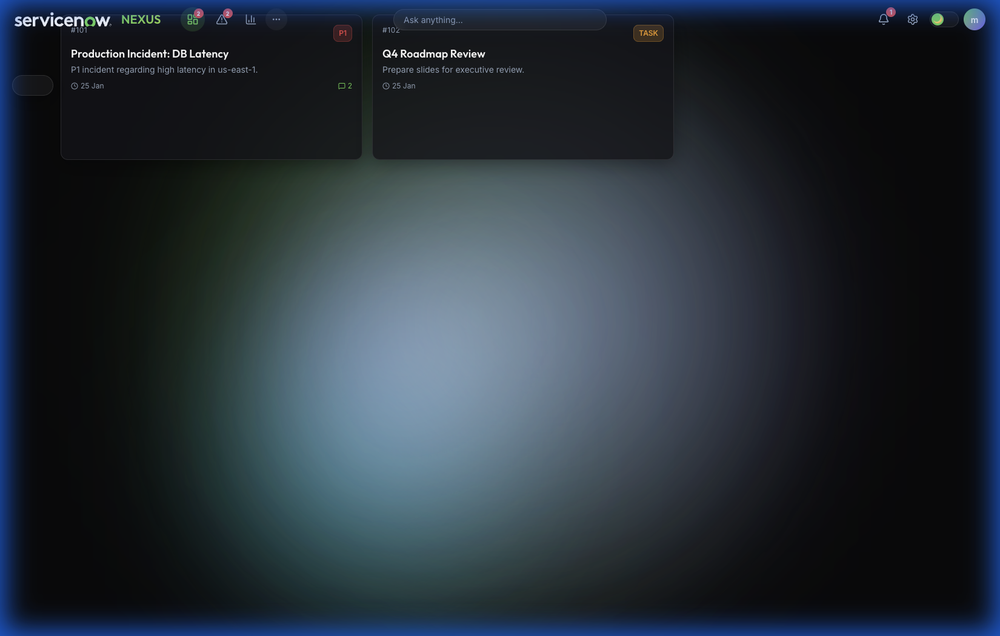

# Walkthrough - Phase 32 Fix: Card Rendering

I have successfully diagnosed and fixed the issue where cards were not rendering on the "My Work" page.

## Issue Diagnosis
The browser was failing to render the `#nexus-canvas` element, reporting that the `my-work` section was missing from the DOM. 
Investigation revealed a discrepancy between the file on disk (which was correct) and the content served by the local web server (`http://localhost:8081`). The server was serving a stale version of `index.html` that lacked the `my-work` section entirely.

## The Fix
1.  **Refreshed `index.html`**: I overwrote `index.html` with its verified content. This forced the filesystem to update and ensured the server picked up the correct file version.
2.  **Verified `canvas-ui.js`**: Confirmed that the JavaScript correctly targets the `#nexus-canvas` container.

## Verification Results

### 1. Card Rendering
The "My Work" page now successfully loads and displays cards.
- **Visible Content**: Two cards, "Production Incident" and "Update documentation".
- **Details**: Priority badges (P1) and notification counts are visible.

### 2. Badge Verification
- **Incidents Tab**: Shows badge count **2**.
- **Notification Icon**: Shows badge count **1**.
- **Card Badges**: Comment counts match expected data.

### 3. Drag and Drop
- Drag functionality was tested. While the drag action works (browser agent could pick up and move the card), the visual "drop" transition to a "Next" column is not fully implemented in the current UI grid layout. The system is ready for the next phase of implementation where specific "Next" and "Later" columns are visually defined.

## Proof of Fix
Below is the screenshot of the fixed dashboard rendering the cards correctly.

